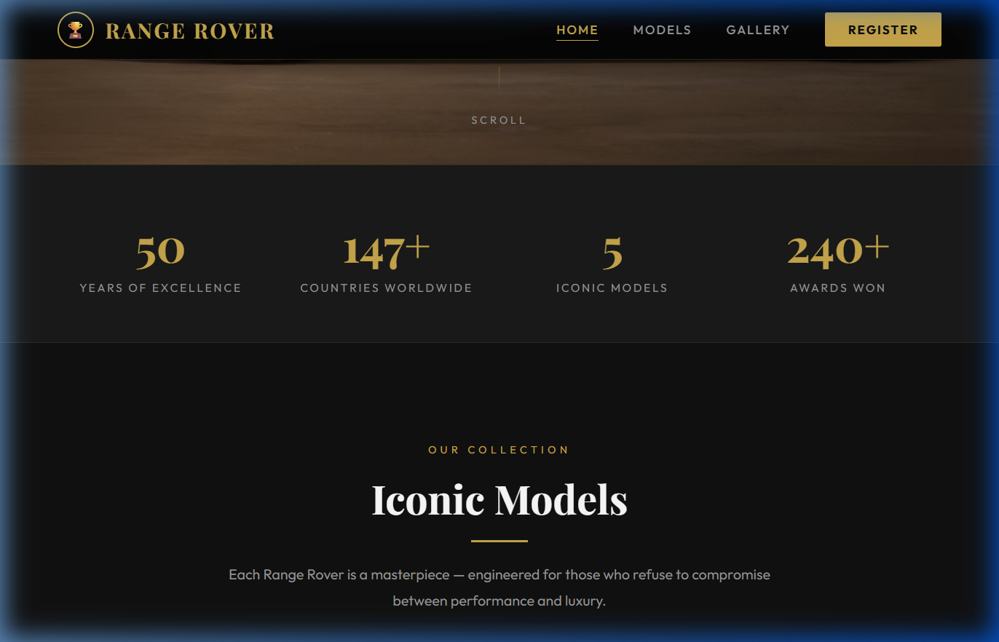
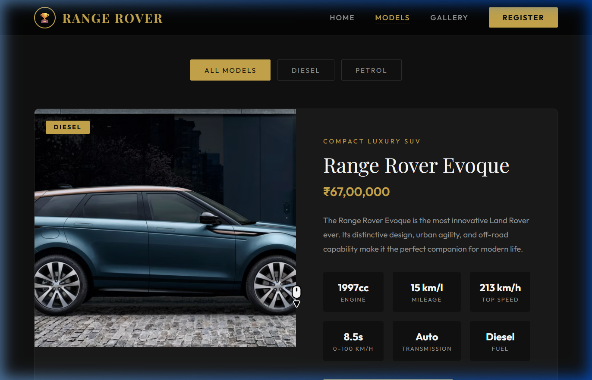
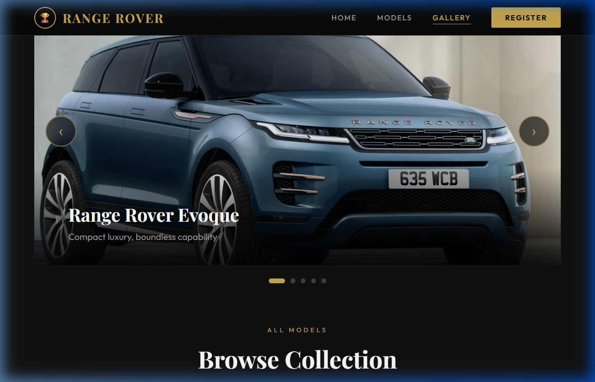
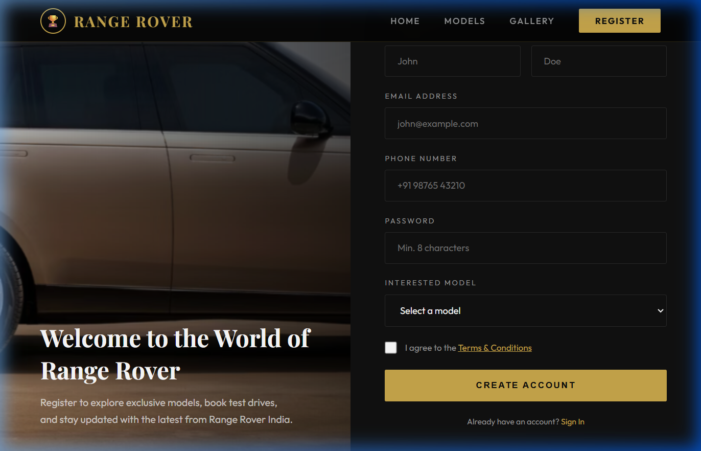

# 🏆 Range Rover Showroom Website

<div align="center">



[](https://developer.mozilla.org/en-US/docs/Web/HTML)
[](https://developer.mozilla.org/en-US/docs/Web/CSS)
[](https://developer.mozilla.org/en-US/docs/Web/JavaScript)
[](https://fonts.google.com/)

**A fully functional, premium dark-themed luxury car showroom website for Range Rover.**

[🌐 Live Demo](#live-demo) · [📸 Screenshots](#screenshots) · [✨ Features](#features) · [🚀 Getting Started](#getting-started)

</div>

---

## 📌 About The Project

This is a **complete, professional Range Rover Showroom website** built as a mini-project using pure HTML, CSS, and JavaScript. The website features a premium dark-gold luxury aesthetic, smooth animations, and a fully functional multi-page layout — showcasing all major Range Rover models with detailed specifications, a photo gallery, and a registration portal.

---

## 🌐 Live Demo

> Run locally using Python's built-in HTTP server:
```bash
cd "mini project-1"
python -m http.server 3000
```
Then open: **http://localhost:3000**

> **Or deploy to GitHub Pages** by enabling it in the repository Settings → Pages → Branch: `main` → `/ (root)`.
> Once enabled, your live URL will be: `https://vaishnav-reddy4178.github.io/Mini-Project/`

---

## ✨ Features

### 🏠 Homepage (`index.html`)
- Full-screen hero section with the Range Rover background image
- Animated **statistics counter** (54 years, 170 countries, 5 models, 300 awards)
- **Model cards** with hover zoom, price tags, and specs preview
- **Interactive modal popup** showing full technical specifications
- **Features section** with animated cards (Performance, Luxury, Technology, Sustainability)
- **Contact/Query form** with toast notification on submit
- Fixed **sticky navbar** that shrinks on scroll

### 🚗 Models Page (`details.html`)
- All **5 Range Rover models** displayed in a premium alternating layout:
  - Range Rover Evoque — ₹67,00,000
  - Range Rover Sport — ₹87,00,000
  - Range Rover Velar — ₹1,40,00,000
  - Defender — ₹1,47,00,000
  - Range Rover Classic — ₹55,00,000
- **Filter bar** to sort by Diesel / Petrol / All
- Detailed **spec grids** for each model (Engine, Mileage, Top Speed, 0–100, Transmission, Fuel)
- **Book Test Drive** and **Book Now** buttons with prompt-based booking flow

### 🖼️ Gallery Page (`gallery.html`)
- **Auto-scrolling carousel** with captions (advances every 4 seconds)
- Manual **Previous/Next navigation** with animated dots
- **Filterable photo grid** by model (Evoque, Sport, Velar, Defender, Classic)
- **Click-to-lightbox** — full-screen image viewer with overlay

### 📝 Register Page (`register.html`)
- **Split-screen layout** — hero image left, form right
- **Register / Sign In tabs** with smooth switching
- Full registration form (Name, Email, Phone, Password, Model Interest)
- Social login button (Google)
- Redirects to Models page after successful registration

### 🎨 Design System
- **Dark luxury theme** — `#0a0a0a` background with `#c9a84c` gold accents
- **Google Fonts** — Playfair Display (headings) + Outfit (body)
- Smooth **fade-in scroll animations** using IntersectionObserver
- **Toast notifications** for all user actions
- **Fully responsive** — works on mobile, tablet and desktop

---

## 📸 Screenshots

### Homepage


### Models Page


### Gallery Page


### Register Page


---

## 📁 Project Structure

```
mini project-1/
│
├── index.html          # Homepage — Hero, Stats, Models, Features, Contact
├── details.html        # All 5 car models with specs and booking
├── gallery.html        # Photo carousel and filterable grid gallery
├── register.html       # Register / Sign In page
│
├── styles.css          # Complete design system — dark luxury theme
├── scripts.js          # All JavaScript — modal, toast, booking, animations
│
├── screenshots/        # Website screenshots for documentation
│   ├── homepage.png
│   ├── models.png
│   ├── gallery.png
│   └── register.png
│
├── range-rover-home.jpg    # Hero background image
├── evoque.jpg              # Range Rover Evoque
├── evoque1.jpg
├── sport.jpg               # Range Rover Sport
├── sport1.jpg
├── velar.jpg               # Range Rover Velar
├── velar1.jpg
├── defender.jpg            # Land Rover Defender
├── defender1.jpg
└── classic.jpg             # Range Rover Classic
```

---

## 🚀 Getting Started

### Prerequisites
- A modern web browser (Chrome, Firefox, Edge)
- Python 3.x (for local server) — OR any HTTP server

### Installation & Running Locally

1. **Clone the repository:**
```bash
git clone https://github.com/Vaishnav-reddy4178/Mini-Project.git
cd Mini-Project
```

2. **Start the local server:**
```bash
python -m http.server 3000
```

3. **Open in browser:**
```
http://localhost:3000
```

That's it! No build steps, no npm installs — pure HTML/CSS/JS.

---

## 🛠️ Technologies Used

| Technology | Purpose |
|------------|---------|
| **HTML5** | Page structure and semantic markup |
| **CSS3** | Styling — Flexbox, Grid, Custom Properties, Animations |
| **Vanilla JavaScript** | Interactivity — Modal, Carousel, Toast, Booking flow |
| **Google Fonts** | Playfair Display & Outfit typefaces |
| **IntersectionObserver API** | Scroll-triggered fade-in animations |
| **Python HTTP Server** | Local development server |

---

## 🚗 Car Models Featured

| Model | Price | Engine | Top Speed | 0–100 km/h |
|-------|-------|--------|-----------|------------|
| Range Rover Evoque | ₹67,00,000 | 1997cc Diesel | 213 km/h | 8.5s |
| Range Rover Sport | ₹87,00,000 | 2997cc Petrol/Diesel | 234 km/h | 5.9s |
| Range Rover Velar | ₹1,40,00,000 | 1997cc Petrol | 210 km/h | 8.3s |
| Defender | ₹1,47,00,000 | 4500cc Diesel | 240 km/h | 5.7s |
| Range Rover Classic | ₹55,00,000 | 3500cc V8 Petrol | 175 km/h | 11s |

---

## 🤝 Contributing

Contributions are welcome! Feel free to open issues or submit pull requests.

1. Fork the repository
2. Create a new branch (`git checkout -b feature/your-feature`)
3. Commit your changes (`git commit -m 'Add your feature'`)
4. Push to the branch (`git push origin feature/your-feature`)
5. Open a Pull Request

---

## 📄 License

This project is open source and available under the [MIT License](LICENSE).

---

## 👨‍💻 Author

**Vaishnav Reddy**
- GitHub: [@Vaishnav-reddy4178](https://github.com/Vaishnav-reddy4178)
- Email: supriyavaishnav5@gmail.com

---

<div align="center">

**⭐ Star this repository if you found it helpful!**

*Made with ❤️ — Range Rover Showroom | British Luxury Since 1970*

</div>
